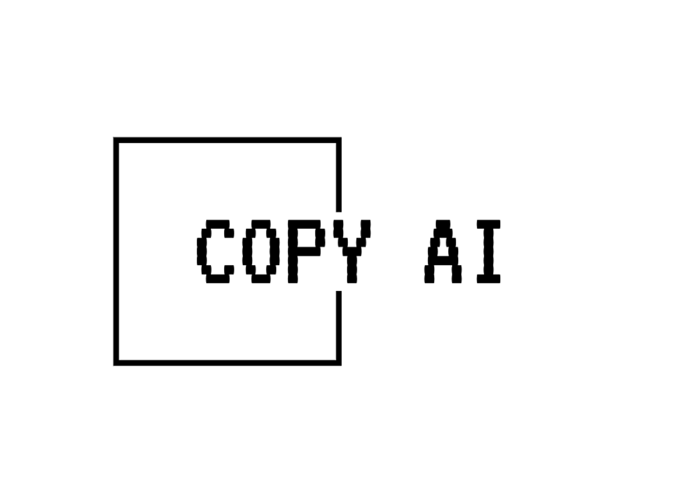

<p align="center">
  
</p>

# Copy AI

## Description

The Copy AI extension allows you to copy the contents of files within a folder or selected files to the clipboard directly from the VS Code context menu. This is particularly useful for quickly sharing code snippets or combining multiple files' contents into one clipboard action.

## Features

- **Copy Folder Content**: Right-click a folder and select 'Copy File Content for AI' to copy the contents of all files within the folder that match specified glob patterns.
- **Copy Single File**: Right-click a single file and select 'Copy File Content for AI' to copy the content of the file to the clipboard.
- **Copy Multiple Selections**: Right-click multiple selected files or folders and select 'Copy File Content for AI' to copy the contents of all selected items.

## Configuration

### `copyAI.include`

Specifies the glob patterns to include when copying folder contents.

Default:

```json
{
  "copyAI.include": ["**/*.{js,ts,jsx,tsx}"]
}
```

### `copyAI.exclude`

Specifies the glob patterns to exclude when copying folder contents.

Default:

```json
{
  "copyAI.exclude": ["node_modules"]
}
```

### `copyAI.maxContentSize`

Specifies the maximum content size (in bytes) to copy to the clipboard.

Default:

```json
{
  "copyAI.maxContentSize": 1048576
}
```

### `copyAI.removeComments`

Specifies whether to remove comments from the copied content.

Default:

```json
{
  "copyAI.removeComments": false
}
```

### `copyAI.minimize`

Specifies whether to remove all whitespaces from the copied text to conserve space in clipboard.

Default:

```json
{
  "copyAI.minimize": true
}
```

### `copyAI.gitignore`

Specifies whether to respect .gitignore rules when copying folder contents.

Default:

```json
{
  "copyAI.gitignore": true
}
```

### `copyAI.includeMetadata`

Specifies whether to include file metadata (size, last modified date) in the header.

Default:

```json
{
  "copyAI.includeMetadata": false
}
```

### `copyAI.includePath`

Specifies whether to include the file path in the header.

Default:

```json
{
  "copyAI.includePath": false
}
```

### `copyAI.includeInstruction`

Specifies whether to include the instruction text in the instruction.

Default:

```json
{
  "copyAI.includeInstruction": "Ensure that the file path appears as a header before the code block.\nYour task is to."
}
```

## Changelog

See [CHANGELOG.md](CHANGELOG.md) for details.

## Installation

1. Install the extension from the VS Code marketplace.
2. Configure the extension settings in your `settings.json` file if necessary.

## Usage

1. **Copy Folder Content**:

   - Right-click on a folder in the VS Code Explorer.
   - Select 'Copy File Content for AI'.

2. **Copy Single File**:

   - Right-click on a file in the VS Code Explorer.
   - Select 'Copy File Content for AI'.

3. **Copy Multiple Selections**:
   - Select multiple files or folders in the VS Code Explorer.
   - Right-click on one of the selected items.
   - Select 'Copy File Content for AI'.

## Contributing

Feel free to contribute to the project by submitting issues or pull requests. Please follow the code style and guidelines outlined in the repository.

## License

This project is licensed under the MIT License. See the [LICENSE](LICENSE) file for details.
